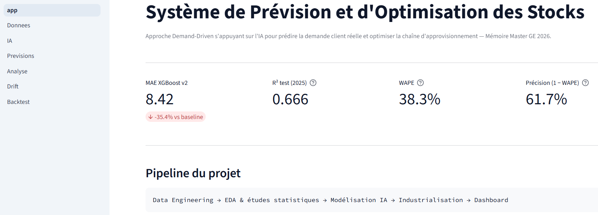
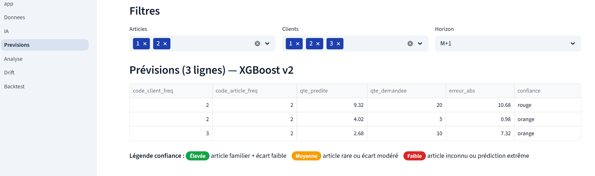
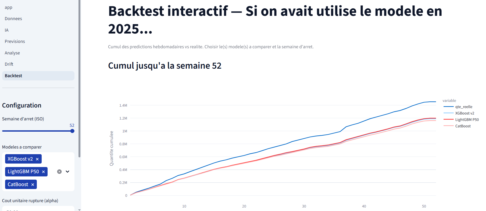

# Système de Prévision et d'Optimisation des Stocks

Prévision de la demande client et aide à la décision d'approvisionnement, sur un historique de commandes / livraisons industrielles 2021-2025.
Le projet couvre toute la chaîne : nettoyage des données, études statistiques, modélisation, comparaison à une baseline métier **DDMRP**, puis restitution dans un dashboard **Streamlit** pensé pour un planificateur (*human-in-the-loop*).

> Travail de mémoire — Master Génie Électrique / Supply Chain, 2026.



---

## Résultat en une ligne

Le modèle de production (**XGBoost v2**, 47 features) atteint **MAE 8.42** et **WAPE 38.3 %** sur l'année de test 2025, soit **−29 % de MAE** par rapport à la baseline « médiane historique par couple (client, article) ».

| Métrique (test 2025) | Baseline médiane | XGBoost v2 | Écart |
|---|---|---|---|
| MAE | 11.87 | **8.42** | −29.0 % |
| RMSE | 132.17 | **101.83** | −23.0 % |
| R² | 0.438 | **0.666** | +52.1 % |
| WAPE | 54.05 % | **38.34 %** | −29.1 % |

Détail complet des modèles, des limites et des biais : [`docs/MODEL_CARD.md`](docs/MODEL_CARD.md).

---

## Ce que fait le projet

1. **Data engineering** — nettoyage des extractions commandes / livraisons, rapprochement commande ↔ livraison, enrichissement par données ouvertes (IPI INSEE, jours fériés, météo Météo-France).
2. **Études statistiques** — EDA, décomposition saisonnière, ACF/PACF, corrélations, causalité de Granger, analyse de Pareto sur les articles stratégiques.
3. **Feature engineering temporel** — lags 1/7/30, moyennes et écarts-types glissants 7/30/90 (par couple, par client, par article), target encoding en fold temporel, dynamique de prix.
4. **Modélisation** — XGBoost optimisé par Optuna (300 essais), LightGBM quantile P10/P50/P90 pour les intervalles, CatBoost, stacking Ridge, LSTM sur le délai (*time-to-event*).
5. **Baseline métier** — implémentation DDMRP (Ptak & Smith, 2016) et comparaison honnête IA / DDMRP / hybride sur les 22 articles du Pareto 80 %.
6. **Industrialisation légère** — script de ré-entraînement, détection de drift par PSI, backtest interactif, tests unitaires et CI GitHub Actions.

---

## Le dashboard

```bash
pip install -r dashboard/requirements_dashboard.txt
streamlit run dashboard/app.py   # http://localhost:8501
```

| Page | Rôle |
|---|---|
| **Accueil** | KPIs du modèle actif, pipeline du projet |
| **📂 Données** | Import d'un dataset, validation de schéma, contrôles qualité, revue manuelle |
| **🤖 IA** | Modèle actif, performances, feature importance, benchmark des architectures |
| **📈 Prévisions** | Prédictions avec score de confiance vert/orange/rouge, export, simulation *what-if* |
| **🔍 Analyse** | IA vs baseline, top erreurs, saisonnalité, stacking et DDMRP, limites assumées |
| **📉 Drift** | Population Stability Index par feature, seuils 0.10 / 0.25, recommandation de retrain |
| **📊 Backtest** | « Si on avait utilisé le modèle en 2025 » — coût cumulé α·ruptures + β·sur-stock |

<p align="center">
  
  
</p>

Le score de confiance et la matrice de gouvernance (vert = validation auto, orange = revue à T+24h, rouge = revue obligatoire) sont décrits au §7.3 de la model card.

---

## Prérequis avant de lancer

Le dépôt ne contient **pas** les données sources ni les artefacts les plus lourds — ils sont exclus par [`.gitignore`](.gitignore) :

- extractions commandes / livraisons 2021-2025 (données internes) ;
- splits `data/processed/split_*_v3_features.parquet` ;
- `models/xgboost_optuna_v2.pkl` (> 100 Mo).

Sont versionnés en revanche : les étapes CSV intermédiaires (`data/processed/*_step*.csv`), les modèles < 100 Mo (`models/`), les rapports de métriques (`reports/*.json`) et les figures.

Pour rejouer le pipeline à partir de vos propres extractions, exécuter les notebooks dans l'ordre, puis ré-entraîner :

```bash
python src/retrain.py --quick   # 30 essais Optuna, ~5 min
python src/retrain.py --full    # 100 essais, ~30 min
```

Les sorties vont dans `models/xgboost_optuna_v2_<horodatage>.pkl` et `logs/`.

---

## Structure du dépôt

```
notebooks/          01 nettoyage → 04 features → 09 DDMRP → 11 backtest
src/retrain.py      ré-entraînement XGBoost + Optuna
dashboard/
  app.py            accueil
  pages/            6 pages Streamlit
  utils/            inference, confidence, ddmrp, drift, features, whatif, stock_mock
  components/       kpi_card, confidence_badge
  tests/            27 tests unitaires
data/processed/     étapes de nettoyage et dataset ML final (CSV)
data/external/      IPI INSEE, caractéristiques
models/             modèles sérialisés + hyperparamètres
reports/            figures, métriques JSON, rapports, mémoire PDF, présentation
docs/MODEL_CARD.md  carte de modèle (métriques, limites, éthique, gouvernance)
AMELIORATIONS.md    audit et axes d'amélioration par phase
```

---

## Tests et intégration continue

```bash
python -m pytest dashboard/tests -v --cov=dashboard/utils
```

27 tests couvrent les utilitaires du dashboard (confiance, DDMRP, drift, features, chargement, stock fictif) — couverture ~88-100 % sur `dashboard/utils/`.
La CI ([`.github/workflows/ci.yml`](.github/workflows/ci.yml)) rejoue `ruff` puis `pytest` sur une matrice **Python 3.11 / 3.13** à chaque push et chaque pull request sur `master`.

---

## Stack

Python 3.11+ · pandas · NumPy · scikit-learn · XGBoost · LightGBM · CatBoost · PyTorch · Optuna · Streamlit · Plotly · pytest · ruff · GitHub Actions

---

## Limites assumées

- Les stocks réels ne sont pas dans le périmètre : la comparaison IA / DDMRP s'appuie sur un **stock initial fictif** (`utils/stock_mock.py`), hypothèse documentée.
- Le modèle est moins fiable sur la **longue traîne** (articles rarement commandés) — c'est précisément ce que signale le score de confiance.
- L'intervalle P10-P90 couvre **74.6 %** des observations contre 80 % visés : légère sous-couverture à investiguer.
- Météo et IPI sont disponibles à une granularité départementale / nationale, pas au niveau du client.
- Le **stacking Ridge** obtient de meilleurs RMSE (97.55) et R² (0.694) mais n'est **pas déployé** : le gain ne justifie pas la complexité ajoutée.

Les axes de travail identifiés, phase par phase, sont consignés dans [`AMELIORATIONS.md`](AMELIORATIONS.md).

---

## Références

- Ptak, C. & Smith, C. (2016). *Demand Driven Material Requirements Planning (DDMRP)*. Industrial Press.
- INSEE — Indice de production industrielle (IPI), séries mensuelles.
- Météo-France — données climatologiques ouvertes.

---

## Auteur

**Adham Marrakchi** — mémoire de Master, 2026.
Les données d'entreprise utilisées pour l'entraînement sont confidentielles et ne sont pas distribuées avec ce dépôt.
